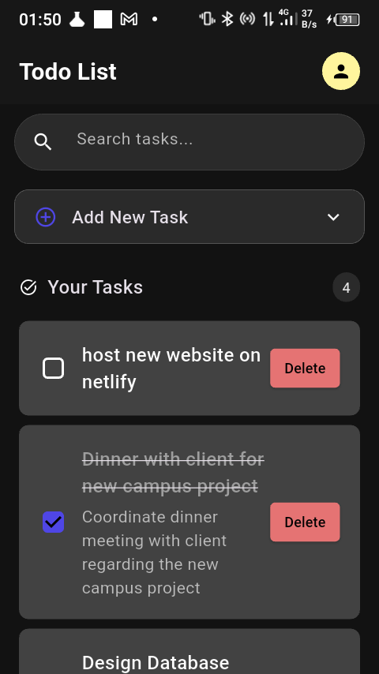

# flutter-todo-app

A mobile **Todo App** built with **Flutter** that interacts with a shared backend powered by **Next.js** and **PostgreSQL**. This app supports authentication and full CRUD operations on todos, using **Dio** for HTTP requests and **SharedPreferences** for secure token storage.



## Features

- JWT-based authentication (Login & Register)
- Secure token storage using SharedPreferences
- Todo operations (Add, Update, Delete, Search)
- API integration with Next.js backend using Dio
- Simple and clean UI for mobile

---

## Getting Started

### Prerequisites

- Flutter 3.x
- A running instance of your Next.js backend (check [`todo-app`](https://github.com/Adhishtanaka/todo-app))

### Setup Instructions

```bash
# Clone the repository
git clone https://github.com/Adhishtanaka/todo-flutter-app.git
cd todo-flutter-app

# Get packages
flutter pub get

# Run the app
flutter run
```

---

## Authentication Logic

- On login the API returns a **JWT token**.
- The token is stored locally using **SharedPreferences**.
- For future API requests, Dio includes this token in the `Authorization` header.
- If the token is missing or expired, the user is redirected to login.

---

## Notes

- This app assumes that the Next.js backend is configured with CORS and accessible from your device/emulator.
- This is an educational app and is **not yet production-ready**.
- Consider adding validation, error handling, and biometric login for enhanced security.

---

## License

This app is open source and available under the [MIT License](LICENSE).

## Contact

- **Author**: [Adhishtanaka](https://github.com/Adhishtanaka)
- **Email**: kulasoooriyaa@gmail.com

## Contributing

Found a bug or want to suggest improvements? Open an issue or PR on the [GitHub repository](https://github.com/Adhishtanaka/todo-flutter-app).

